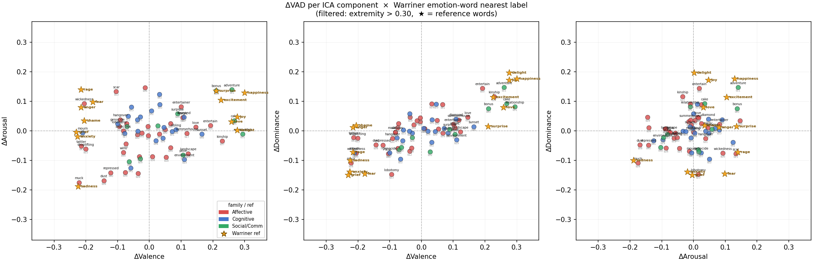

# 30. 生成テキストからの VAD 推定（threshold_vad）

## 1. 実験の理由

[16_caa_basis_decomposition.md](16_caa_basis_decomposition.md) で CAA ベクトルが
VAD 3軸では再構成できない（$R^2 = 0.017$）という**幾何学的**結果が得られた。
これは「basis ベクトルと VAD 軸が直交に近い」ことを示すが、
**行動的**観点での検証は未実施だった。

本実験の問い：  
> *基底成分 $b_i$ でステアリングした場合、生成されたテキストの VAD は変化するか？*

これは「ベクトル空間の幾何」ではなく「モデルの出力の感情的内容」を問う独立した問いであり、
$R^2 = 0.017$ の結果とは概念的に分離されている。

---

## 2. 手法

### 2.1 入力

- **ステアリング済み生成テキスト**：[29_threshold_rewrites.md](../EXPERIMENT_LOG.md) で
  生成済みの `experiments/results/threshold_rewrites/ica_k064_L22/b{00..63}.json`  
  各成分 × 8プロンプト × 正負2方向 = **1,024テキスト**

- **VAD 写像**：`data/emotion_code/vad_mapping.pt`（layer=19、$W \in \mathbb{R}^{3 \times 4096}$、$b \in \mathbb{R}^3$）  
  評定精度：$R^2_V = 0.561,\ R^2_A = 0.245,\ R^2_D = 0.158$

### 2.2 処理パイプライン

各成分 $i$ に対して：

1. 正方向生成テキスト群 $\{t^+_{i,p}\}_{p=1}^{8}$ と負方向 $\{t^-_{i,p}\}$ を結合してバッチ入力
2. `collect_batch()` で layer 19 の last-token 残差 $\mathbf{h} \in \mathbb{R}^{4096}$ を取得
3. VAD を推定：$\hat{\mathbf{v}} = W\mathbf{h} + b$
4. $\Delta\text{VAD}_{i,p} = \hat{\mathbf{v}}^+_{i,p} - \hat{\mathbf{v}}^-_{i,p}$ を計算

成分ごとの代表値として 8プロンプトにわたる平均 $\overline{\Delta\text{VAD}}_i$ を使用。

### 2.3 スクリプト

```bash
source .venv/bin/activate
python experiments/eval_threshold_vad.py
```

---

## 3. 結果

### 3.1 Grand-mean ΔVAD

64成分 × 8プロンプトにわたる全体平均：

| 軸 | $\overline{\Delta}$（符号付き） | $\overline{|\Delta|}$ |
|---|---:|---:|
| Valence   | +0.0078 | 0.274 |
| Arousal   | −0.0070 | 0.177 |
| Dominance | +0.0013 | 0.131 |

grand-mean は実質ゼロ、$|\Delta| > 0.3$ の成分は **0 / 64**。

### 3.2 上位成分（$|\Delta V|$ 順）

| 成分 | $\Delta V$ | $\Delta A$ | $\Delta D$ | Warriner 感情語 | 軸名（正極 ↔ 負極） |
|---|---:|---:|---:|---|---|
| b51 | +0.294 | −0.011 | +0.082 | sweet（甘い） | Confidence ↔ Uncertainty |
| b55 | +0.268 | +0.035 | +0.093 | puppy（子犬） | Confidence ↔ Uncertainty |
| b11 | +0.260 | +0.140 | +0.147 | adventure（冒険） | Trust ↔ Distrust |
| b37 | +0.229 | −0.034 | +0.116 | honest（誠実） | Confidence ↔ Uncertainty |
| b04 | −0.222 | −0.175 | −0.109 | muck（汚泥） | Surprise ↔ Anger |
| b43 | −0.214 | −0.052 | −0.023 | shun（避ける） | Confidence ↔ Uncertainty |
| b45 | −0.210 | −0.006 | −0.074 | mourning（喪） | Confidence ↔ Uncertainty |
| b06 | −0.205 | +0.092 | −0.076 | wickedness（邪悪さ） | Engagement ↔ Apathy |
| b05 | −0.200 | −0.062 | −0.025 | hater（嫌悪者） | Trust ↔ Distrust |

### 3.3 Warriner 語彙との照合

Warriner（2013）の 13,915語から $|V_\text{norm}| > 0.30$ かつ $|A_\text{norm}| > 0.20$ の
2,374語（VAD 両軸に強い語）に絞り、コサイン近傍で各成分に感情語を対応付けた。
重複なし（64成分 × ユニーク64語）で解決。

完全な対応表：[component_word_table.csv](../../experiments/results/threshold_vad/component_word_table.csv)

### 3.4 VAD 空間プロット

64成分の ΔVAD を3面（V–A / V–D / A–D）に投影した散布図：



- ★：Warriner 参照感情語（joy, anger, fear, sadness, happiness, rage など）
- 色：感情 family（赤=Affective, 青=Cognitive, 緑=Social/Comm）
- ラベル：各成分の Warriner 最近傍感情語

---

## 4. 考察

### 4.1 Grand-mean ≈ 0：basis の双方向性

64成分の ΔVAD 平均がほぼゼロというのは、ICA basis が VAD 空間を
「正方向にも負方向にも均等にカバーしている」ことを意味する。
これは独立成分分析の性質（非ガウス的・双方向な方向を抽出）と整合する。

### 4.2 幾何学的結果との整合

[16_caa_basis_decomposition.md](16_caa_basis_decomposition.md) の
$R^2 = 0.017$（CAA ベクトルが VAD 3軸で説明できない）は、
basis ベクトル $\mathbf{w}_i$ が VAD 軸 $W_{3 \times 4096}$ と直交に近いことを示す。
本実験の $|\Delta V|_\max \approx 0.29$（弱いが非ゼロ）は、
その幾何学的関係が生成テキストの VAD に反映されていることを示す行動的補完である。

### 4.3 Valence > Arousal > Dominance の順序保存

vad_mapping の読み出し精度 $R^2_V > R^2_A > R^2_D$ の順序が、
生成テキストへの ΔVAD 効果の大小 $|\Delta V| > |\Delta A| > |\Delta D|$ にも保存された。
残差空間での線形読み出しやすさが行動的効果の大きさに対応している。

### 4.4 限界：ΔVAD ノルムが小さい成分

$|\Delta\text{VAD}|_i \approx 0$（ノルム < 0.05）の成分では VAD 空間での「方向」が定まらず、
Warriner 最近傍語が感情語として不自然（donkey, landscape, deer など）になる。
これらの成分は VAD とほぼ直交しており、感情語彙での解釈が原理的に困難。

---

## 5. 出力ファイル

| パス | 内容 |
|---|---|
| `experiments/results/threshold_vad/per_component_prompt.parquet` | 全（成分, プロンプト, 軸）の生 ΔVAD |
| `experiments/results/threshold_vad/component_means.csv` | 成分ごとの平均 ΔVAD（V / A / D） |
| `experiments/results/threshold_vad/summary.json` | grand-mean・|Δ| 統計 |
| `experiments/results/threshold_vad/component_word_table.csv` | 64成分 × 感情語・中立語・軸名 |
| `experiments/results/threshold_vad/vad_2d_warriner_emo.png` | Warriner ラベル付き VAD 散布図（3面） |
| `experiments/results/threshold_vad/vad_3d.png` | 3D VAD 散布図 |
